Visual Studio is hands down the best IDE this world has yet to offer for C-languages. It has a gazillion features, many of which are easy to miss if you've never seen them. This article is about 7 minor hidden features of Visual Studio which I really dig and perhaps you will too.
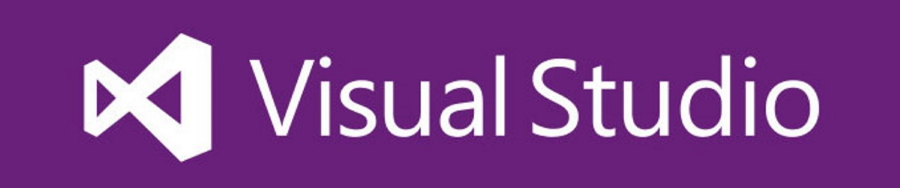

Table of contents
----

1. [Visual Studio as a Diff/Merge tool](#tip1visualstudioasadiffandmergetool)
1. [Sound the alarm when your build finishes](#tip2soundthealarmwhenyourbuildfinishes)
1. [Scroll quickly in large files](#tip3scrollquicklyinlargefiles)
1. [Font ligatures can make your code prettier](#tip4fontligatures)
1. [Stop rebuilding accidentally](#tip5stoprebuildingonaccidents)
1. [Track all of your TODOs](#tip6trackallofyourtodoitems)
1. [Don't run unnecessary builds](#tip7dontrununnecessarybuilds)

## Tip 1: Visual Studio as a Diff and Merge tool

Yes, Visual Studio can be a Diff/Merge tool for your favourite source control system. Doing so lets you benefit from all the things you already love about VS:

- Syntax highlighting in the diff, with you favourite highlighting settings
- You can make changes directly in the diff window
- Opens in the same solution all of your code is in so no need to alt + tab
- VS commands work as expected in the diff window (e.g. Search, Go To Definition, etc.)

Here's how.

### Perforce (P4)

Setting VS as a diff tool for P4 was eye-opening the first time it was shown to me as P4's built-in one is...suboptimal. It's actually really simple to get it done, all you need is to open P4's preferences and apply these settings:

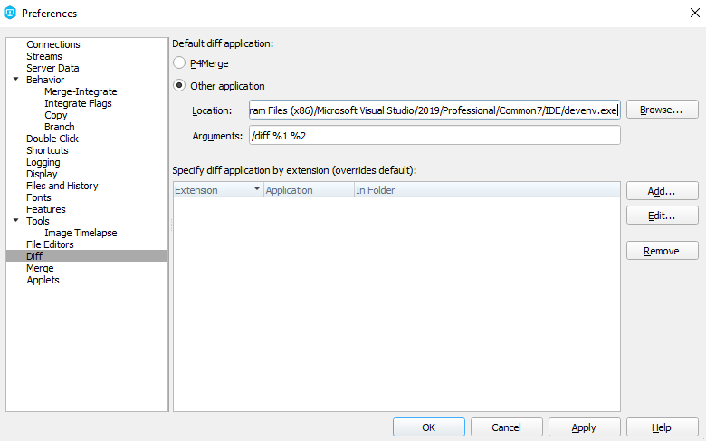

Once this is done, triggering the standard diff from P4 (Right click on the file -> *Diff Against...*) will open the diff in your active Visual Studio solution like so:

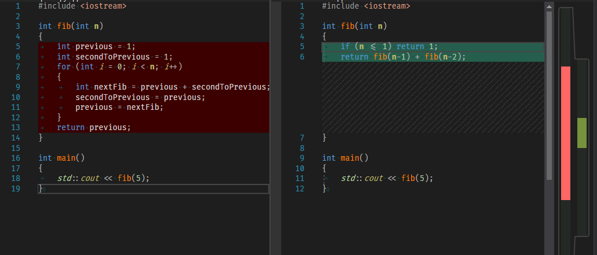

### Git

I am one of those people who enjoys using the CLI of Git and would rather use that instead of a GUI. Unfortunately for me, in my multiple attempts to get VS to act as expected when used through the command line, I couldn't get it to work.

On the bright side, I don't really need to - it turns out Visual Studio's built-in Git plugin is now actually usable and pretty good at what's advertised for.

You don't need to do anything to set it up - any project with a Git directory will automatically be picked up by Visual Studio.

The Team Explorer window contains everything there is to do with source control. I suggest you explore it on your own but here are
the two most basic interactions - diffing your changes since the commit and merging two conflicting commits:

Diff:

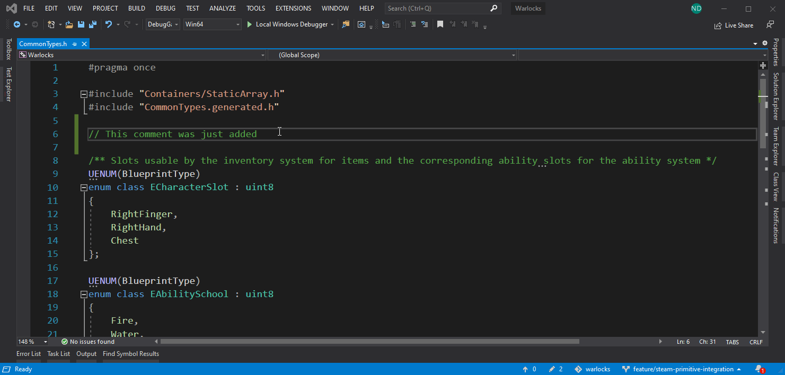

Merge:

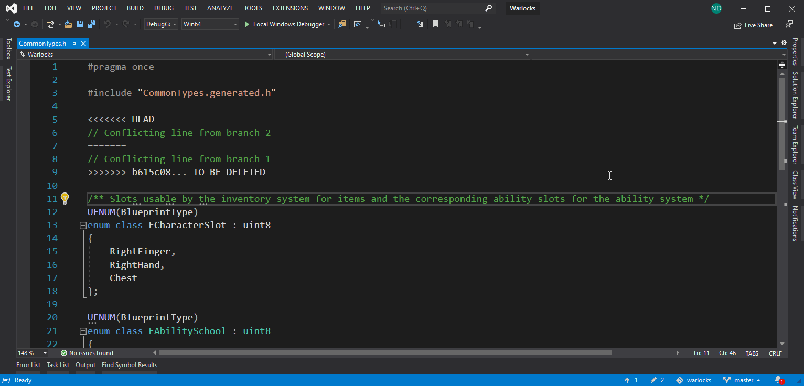

## Tip 2: Sound the alarm when your build finishes

If your build times take as long as mine do, you are probably often looking at other things while the build is running - reading documentation, reviewing code, browsing JIRA, etc. Five minutes later your build has completed but you are so focused on the new task that you forget to go back to your code.

Wouldn't it be great if someone rang a bell when the build completes? Well, Visual Studio can actually do that! You can make VS play any sound by opening your Sound Control Panel (open *Sound Settings* from the Start menu, then click on *Sound Control Panel* on the right), scroll until you get to *Microsoft Visual Studio* and pick your preferred sounds to be played when a build succeeds or fails:

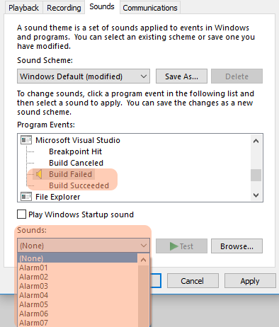

I personally use *Windows Logon* for successful and *Windows Logoff* for failed builds as they are easy to recognize and there's no chance some other program will play them accidentally.

## Tip 3: Scroll quickly in large files

Imagine you just opened a file 1500 lines long which you have never seen before. You are required to make a modification so you have to read it. After scrolling through 1000 lines you forgot something and now have to go back. This is the perfect time to make use of the wide scrollbar:

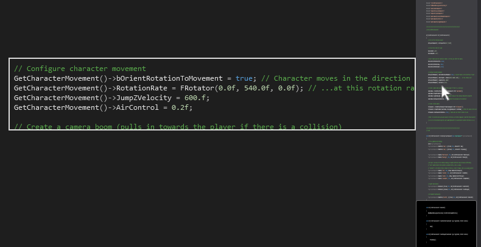

The wide scrollbar lets you see at a glance the structure of your file. The scrollbar renders a preview of your file which makes easy to see where a function/class/block starts and ends. Hovering over the scrollbar shows the snippet of code in that section. In many situations, this can speed up navigation significantly. Wanna go back to that slow nested loop you are optimizing with the if inside? Easy, just look for 3-levels of indentation and you are there.

To enable the wide scrollbar, go to *Tools* -> *Options* -> *Text Editor* -> *All Languages* -> *Scroll Bars*. Then select *Use map mode* under *Behaviour* and pick your preferred width. I personally go for wide but you can decide for yourself. Here's a screenshot of the settings window:

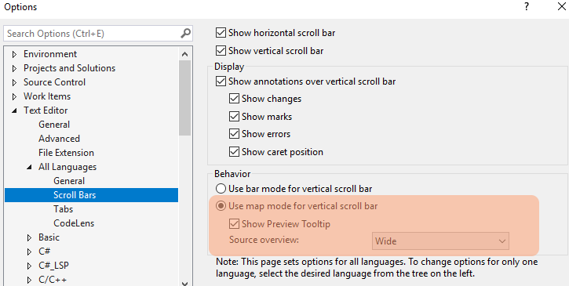

## Tip 4: Font ligatures

This next one is less universally applicable because it's a matter of personal taste. A font file describes how each Unicode symbol should be rendered but one less-known feature of font files is that they can actually ask for several sequential symbols to be rendered with the same glyph. At first, this doesn't sound very interesting until you realize that you can actually take `!=` and render it as `≠`.

Some fonts are specifically designed to benefit from ligatures. Probably the most popular one (and the one I use) is called [Fira Code][firacode-link] and changes your C++ code like so:

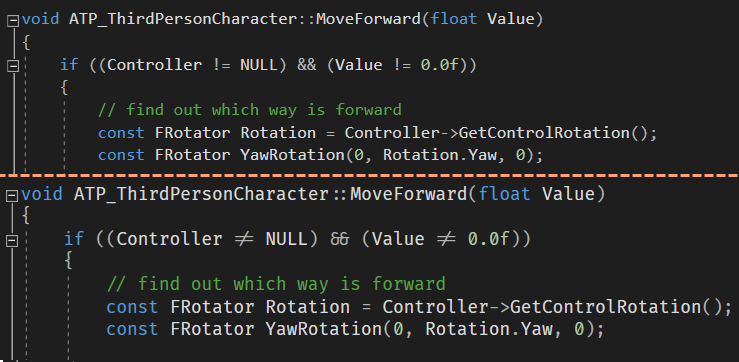

Some people dislike the idea of their editor displaying things that aren't actually there. I understand that point but I also believe that for experienced developers there isn't really an issue - my brain knows there are 2 symbols even if there's a single character on the screen. Use at your own preference.

Getting Fira to work with Visual Studio can be done from  *Tools* -> *Options* -> *Environment* -> *Fonts And Colors*:

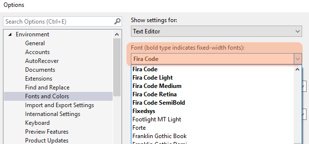

This tip isn't strictly VS-related - you can use Fira code with any editor. To install, just follow the guide on [their github page][firacode-installation-steps].

P.S. One thing to be aware: there's a notable issue with VS and FiraCode with one of the most commonly used C++ symbols - `->`. The pointer arrow has a ligature under FiraCode which doesn't work in VS because of [a known bug][vs-fira-bug].

## Tip 5: Stop rebuilding on accidents

Has this ever happened to you?

<blockquote class="imgur-embed-pub" lang="en" data-id="RV6hrip"><a href="//imgur.com/RV6hrip">when I accidentally click Rebuild instead of Build in visual studio</a></blockquote>

You need to build your project, you casually right-click in Solution Explorer, head for the *Build* button but you overshoot and end up on *Rebuild*? If you realize the mistake and you happen to know the keybinding for Cancel Build you are now maniacally pressing Ctrl + Break but it's too late - your files have already been purged. You are in for a nice coffee break between a minute and a couple of hours depending on your project size.

Ok, so what's a good solution to this tragically placed command in Visual Studio? Well, Visual Studio actually allows you to reorganize menus! You can move the *Rebuild* button away from *Build* or stash it in a sub-menu, like so:

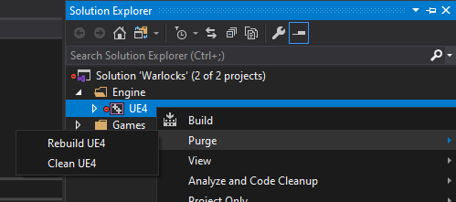

Reordering takes the following steps:

1. Open *Tools* -> *Customize* -> *Commands*
1. Select *Context Menu* and then further select *Project and Solution Context Menus | Project* from the dropdown.
1. Select *Rebuild* and click **Add New Menu**
1. Go back to the *Context Menu* dropdown, select *Project and Solution Context Menus | Project | New Menu*
1. Click **Add New Command** and add whatever commands you want (like *Rebuild Selection* & *Clean Selection*)
1. Go Back to *Project and Solution Context Menus | Project | New Menu*
1. Select the newly added *New Menu*, click on **Modify Selection** and give the submenu a meaningful name
1. Select the *Rebuild* command and click the **Delete** button
1. Repeat for the *Clean* command
1. Enjoy the result

Here is a GIF showing all the steps:

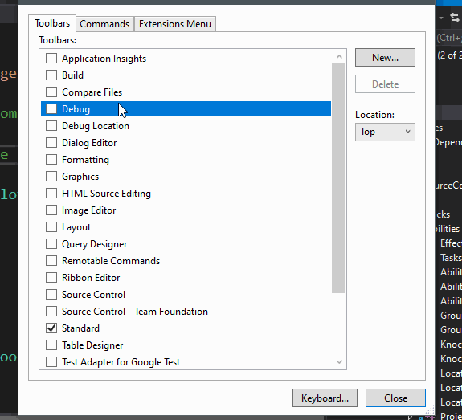

P.S. If you are more inclined to use the build command from the menu at the top of the screen, you can repeat the same steps for it. To do that, you need to select *Menu Bar* -> *Build* instead of *Context Menu* -> *Project and Solution Context Menus | Project* in step 2. And this is the result you'll get:

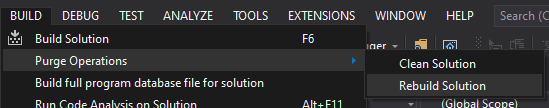

## Tip 6: Track all of your TODO items

Do you love leaving TODO comments in your code for things that you need to do in the future? Then you'd love to know Visual Studio provides a handy window for exactly that - the Todo window.

Reachable from *View* -> *Task List*, this panel searches the code in your project and finds any comment containing the TODO substring:

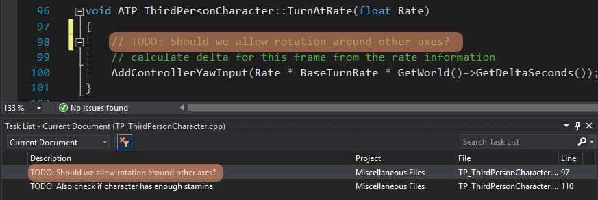

Double-clicking on any of the items will lead you to the line in question. The panel is also searchable so you can quickly find out the exact item you need.

It can also be configured to do more advanced things - like search for other substrings. One thing we do at Ubisoft is when there's a TODO, there must always be a JIRA task for it and one should leave the JIRA ID in the comment (e.g. `// ACV-123: Delete this`). So for example, for the Assassin's Creed Valhalla project, I have it setup to find all strings of the type `ACV-` which makes it easy to find all relevant TODOs for each JIRA task.

## Tip 7: Don't run unnecessary builds

Every so often, you will be working on a project which uses Visual Studio as an IDE but does **NOT** use VS's build system. This is often the case for multiplatform projects which generate project files for a bunch of platform-specific IDEs like VS for Windows and XCode for Mac. In some of those cases, the generated projects will actually use an external command to run the build procedure like Make or NMake. Visual Studio will happily run the external command when you click the UI but it lacks any knowledge about what the command actually does.

And here's the caveat - when you hit F5 to run your code, by default, Visual Studio will first build your project and then run it. If VS is responsible for the build, it knows if building it makes sense at all (e.g. if something has changed since last build). When using an external command, VS knows nothing so it will always execute the external command. If your external command is smart it won't do a thing but more often than not it will take 10-15seconds to actually figure out if something needs to be compiled. A lot of projects I've worked on have suffered from this. Unreal Engine is especially bad since it usually takes 30s on my moderately powerful laptop to realize nothing is worth building. Another example is WebKit - it has a bunch of projects which only generate code for other projects to compile. Some of our internal systems at Ubisoft run external tools as part of the build process and they again suffer the same faith.

The solution to this is pretty trivial and one of the first things I show to every junior programmer I get access to - have VS only build on command:

1. Go to *Tools* -> *Options* -> *Build & Run*
2. Under *Build When Project is Out Of Date*, select *Never build*
3. Click OK/Apply

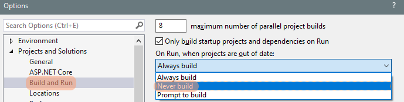

With this setup, hitting F5 will **never** automatically build the project. This is my preferred option but it poses a risk of starting the project with an old build if you forget to build before that. I am so accustomed to using it this way that I never forget to build when I need to. In fact, sometimes I **want to** run with an old build - I often start writing the code to solve a problem, realize I forgot some key piece of information so I restart the program to figure out what that missing information was.

You can also pick the *Prompt to build* option which will show a modal window asking you if you want the project to be compiled or not. This one is too annoying for my taste but it might work better for you.

[firacode-link]: https://github.com/tonsky/FiraCode
[firacode-installation-steps]: https://github.com/tonsky/FiraCode/wiki/Visual-Studio-Instructions
[vs-fira-bug]: https://github.com/tonsky/FiraCode/issues/422
