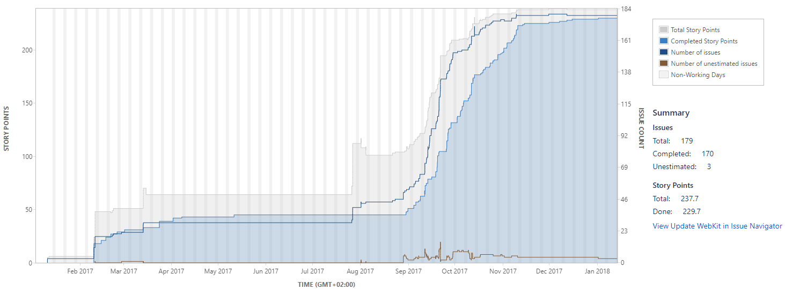
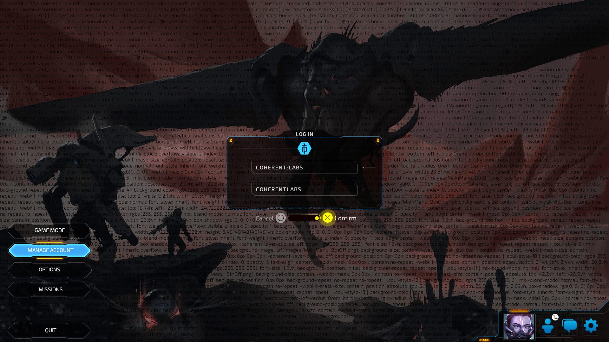
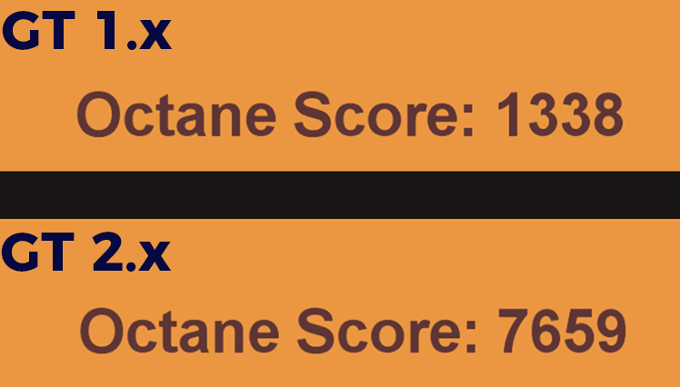

I don't believe I've mentioned my daily job on this blog but now is a good moment to do so - I am a technical PM in [Coherent Labs](https://coherent-labs.com/). Our most popular product [Coherent GT](https://coherent-labs.com/coherent-gt/) is a UI middleware for games and allows people to use HTML5 to create the UI for their games instead of whatever subpar UI system they currently have. It's now used by a huge number of games (e.g. PUBG, GuildWars 2, Law Breakers). The SDK is written entirely in C++.

I had been working on GT for more than 3 years now, but 2017 was the first year I took over the PM responsibilities. Coincidentally, this was also the year we focused on releasing version 2.0. We did, eventually, [release it](https://coherent-labs.com/gt-2-0-released/). Today I want to do a short postmortem and discuss some of the technical challenges we encountered.

## Background

So what's the deal with that new version and why does it deserve a postmortem? Well, Coherent GT uses WebKit, which is one of the few high-grade HTML engines.
We wanted to introduce some modern web features with GT 2.0\. For that, we needed to pull the latest changes from WebKit's upstream but this proved to be rather difficult because our codebase had diverged too much. How much? Let me give you a sense of scale.

We reaaaally care about performance. However, WebKit isn't designed to run in the time we need it to, especially so when page complexity rises. Because of this and the need to extend the HTML standard with some game-specific features, we had replaced entire subsystems. Most notably - rendering, networking, memory management, resource loading and the threading model. Our SDK also supports PS4, XB1 and UWP. This sums up to thousands of commits. My attempt to check how many LOC we've changed overloaded GitHub:


Luckily, the majority of our core code was nicely separated from WebKit. This was intentionally done to minimize dependencies between our own internal systems and theirs and saved us a ton of work.

## Shy beginnings

The first obvious step was to actually fetch the upstream version and merge the two codebases without losing anything in the process - we had patched a ton of issues and everyone on the team was a tad nervous about reintroducing bugs. Unfortunately, Git was overwhelmed by the amount of modifications we had made, so we couldn't just run `git merge webkit-upstream master`. Since tools failed, we had only one option - apply all changes manually. We decided to start by checking out a fresh WebKit and, file per file, redo all modifications.

We came up with this plan:

1.  Download, setup and compile the latest vanilla WebKit version to serve as a sanity check
2.  Delete all of the WebKit code in our repository
3.  Fetch the new version and add it where the old one used to be
4.  Find all files that our team had touched (`git diff --name-only GT-first-commit-ever GT-latest`)
5.  Figure out which of these changes were still relevant
    * Some files were now renamed
    * Others were deleted entirely
    * My favourite example of this were the pair of files *Font.h* and *FontData.h* - *Font.h* was renamed to *FontCascade.h* but *FontData.h* was unhelpfully renamed to *Font.h*.
    1\. With the list of files in place, we could now distribute the workload (e.g. person X applies all changes to files in directory Y)

So that was a pretty solid plan and we were all optimistic about its execution. In the end, the list of files was an 8 page document consisting of 324 file names.

Applying the changes consisted mostly of copy/pasting the old code to where it needed to go in the new version and checking for compilation errors. As simple as that sounds, there were some hurdles even at the start:

* Some of the changes done by the team were actually just application of single upstream commits (e.g. security vulnerabilities and other bug fixes). Since those were already present in upstream, we had to be careful not to waste time trying to reapply them.
* We have a policy that any change done to code we didn't originally write should be surrounded with `// COHERENT BEGIN / COHERENT END` comments. This was of a great help in the update process...most of the time. Despite our rigorous code reviews, some modifications slipped in without comments. Others, although they had comments, didn't make it obvious what exactly had changed. Consider this for example:

    ```cpp
    // COHERENT BEGIN
    WEBCORE_EXPORT void createLiveView(int width, int height);
    // COHERENT END
    ```

    So what changed here? Is this a new method? Was this an existing method which is now exported (via WEBCORE_EXPORT) or was an argument added / removed?
    To circumvent that, the policy was changed to 'Surround all new code with `#if PLATFORM(COHERENT) / #endif` instead of comments'. This helped devs properly separate the before and after code, making the change obvious:

    ```cpp
    #if PLATFORM(COHERENT)
    WEBCORE_EXPORT void createLiveView(int width, int height);
    #endif
    // Ok, there's no #else clause so this must be a new method

    // If, for example, only WEBCORE_EXPORT was added
    // the change would've looked like so
    #if PLATFORM(COHERENT)
    WEBCORE_EXPORT void createLiveView(int width, int height);
    #else
    void createLiveView(int width, int height);
    #endif
    ```

* WebKit had moved to C++14 and was no longer completely dependent on their own standard library (appropriately abbreviated to WTF for Web Template Framework). Now they were using STL instead of WTF for things like `std::unique_ptr`.
* We use tens of interfaces to communicate with the WebKit entities, with the interface being usually implemented outside WebKit. This separation meant that we didn't need to care about a big part of the changes. In spite of the independence, some cases required changes in the interfaces which naturally lead to changes in the core implementations.

The scope creep was very real:

* I myself applied our changes to the generic memory allocator,
* which in turn required changing the interface between the GT core and WebKit,
* which in turn required changing the implementation in the GT core,
* which in turn required changing the public API we provide to clients,
* which in turn would break all of our samples, and our Unity3D plugin, and our UE4 plugin

Fixing one thing would've lead me on an adventure of fixing twenty other things across 3 repositories! In order to avoid the endless scope creep, we started breaking down dependencies and mocking incomplete interface implementations, filling the code with `NOT_IMPLEMENTED()` asserts. This helped us reduce the complexity of any particular change and track progress in a more meaningful way. For example, the number of `NOT_IMPLEMENTED()` occurrences clearly showed how many things we still had to fix.

### The build system

Aaah, 'build system'. The two second-most hated words by programmers around the world, just after 'quality assurance'. Working on the WebKit update quickly became difficult for multiple people because we firstly focused on the code itself and largely ignored the build system.

For GT 1.x, we were using Visual Studio projects with msbuild on Windows, Xcode projects on OSX and CMake on Linux. WebKit itself uses XCode projects on OSX and CMake everywhere else. Now, not only did we need to merge source code changes, we would have to merge build files for 8 platforms! I don't how you feel about that perspective, but to me it sounded like, to put it mildly, a disagreeable task.

I pushed for moving the entire build system over to CMake to at least eliminate all of the different representations of the same data. Besides, CMake is able to generate project files for every IDE so we would keep all the benefits of using the best IDE for any of our platforms. The big question here was whether we can make CMake work for consoles as it obviously didn't have built-in support for them. The short answer is, yes, you can. The long answer includes an entire week of research and experiments of what's required + 4 man-weeks to actually get it to work + several heated internal discussions about whether it's worth it in the first place.

At the end, I believe it was the right decision. I did [a single internal training](https://coherent-labs.com/tech-talk-cmake/) for everyone on the team to catch up with CMake and that was enough to cover pretty much everything we needed.

## Bug bonanza

A clear requirement of our 2.0 version was to be _very_ stable. Stability is clearly something that's hard to measure in an objective way for software that takes thousands of lines of code as input (HTML / JS / CSS files) but we wanted to make sure that the system is _at least as stable as_ any of our previous versions. According to [the data in githyp](http://www.githyp.com/playerunknowns-battlegrounds-129259/player-count) at its peak, PUBG was played by 3+ million players. That means that if our new version crashes on only 0.1% of players' machines, it will still crash on 3 000 people ready to flood PUBG's Steam page with negative reviews.

To verify stability we had only one option - run our new version in actual games. We worked with some of our clients which provided us with debug versions of their UIs and / or games. This proved to be incredibly useful as we discovered tons of bugs our standard test cases missed. A bug-ridden release would've been far worse than no release at all.

The chart, taken directly from our JIRA perfectly shows the moment we started testing with existing live games and detecting all of the bugs.



Yep, that's 179 bugs!

We had them all around the place - textures were disappearing at random, networking was 20 times slower, our debugging tool crashed at random and in the few occasions it didn't, it gave wrong results. Or how about this one which caused the CSS of the page to be displayed over the actual content?



Oh, and it happened only with LTO enabled, only on PS4 and only if you use the automated build system but not if you just hit the 'Build' button from the IDE.

### From 60 FPS to 4 FPS and back

Let me tell you about my favourite bug. One of the games we were most interested in testing has complex UI exercising all of our systems. As mentioned previously, performance has always been incredibly important to us so we were testing from day 1 of the update and even though we knew there were some pessimizations, we did not expect what we saw - the game ran with 60 FPS with GT 1.14 but had a hard time keeping up 4 FPS with our supposedly better 2.0 version!

Something obviously went very wrong - we initially though that we had erroneously used a debug version without optimizations. That was easy enough to verify, but nope, all optimizations were on.

We did some profiling and our internal profiler suggested that the issue was in our scripting system - the one responsible for transferring data between C++ and JS. That system is hugely dependent on JavaScriptCore (JSC) - the JavaScript virtual machine inside WebKit. However, the new JSC version was much faster because it had its JIT enabled (which the previous version didn't) so the results we were seeing were absurd. Running [external JS benchmarks like Octane](http://chromium.github.io/octane/) proved that there was no issue with JSC itself:



We went down the rabbit hole and finally discovered that every time the game transfers data from / to the UI, this [this little gem](https://github.com/WebKit/webkit/blob/edb51731c153aa8aa8b1311c5da032e3e38f7307/Source/JavaScriptCore/runtime/VM.cpp#L801) was executed:

```cpp
#if OS(WINDOWS)
static void preCommitStackMemory(void* stackLimit)
{
const int pageSize = 4096;
for (volatile char* p = reinterpret_cast<char*>(&stackLimit); p > stackLimit; p -= pageSize) {
char ch = *p;
*p = ch;
}
}
#endif
```

This function might as well have been named `slowdownTheEntireProgramPlease()` as that's exactly what it does. If it's not entirely obvious, let me explain - it loads one byte from **every** memory page, effectively trashing all CPU caches and causing huge delays due to nonstop accesses to the main RAM. This might somehow be fine if JSC was running on its own but remember - we are actually running inside a complete game engine and game engines don't really like it when you stall your processor and destroy all smart techniques they are using to keep CPU caches hot. Furthermore, this was not executed during GT's allocated frame time. Rather, it was invoked multiple times, in between gameplay code, like so:

```cpp
ShootRockets();
UpdateRocketAmmoInUI(); // Sends data to GT and ends in preCommitStackMemory
Teleport();
UpdatePlayerPositionOnMap(); // Sends data to GT and ends in preCommitStackMemory
```

So why was this function there in the first place? Well, it was meant to [fix this bug](https://bugs.webkit.org/show_bug.cgi?id=129429). We replaced the call to `preCommitStackMemory` with the much less intrusive [`_chkstk()`](https://msdn.microsoft.com/en-us/library/ms648426(v=vs.85).aspx), we stopped calling all the time and ran sanity checks to verify that we don't reintroduce the bug this fixes. This resulted in a huge performance gain and we were back to 60 FPS.

## Some helpful insight

Although it took us few months to complete the update, I believe we did most things the right way. If you ever find yourself in a similar situation i.e.

* Your work depends on a third party
* That third party needs to be modified for your work to matter
* That third party needs to be (regularly) updated

My experience shows that these tips, summarized from the paragraphs above, can greatly reduce the burden:

* Keep any modifications to the third party consistent with the third party's naming convention and architecture.
* When modifying the third party code, avoid plugging in all of your code directly. Instead, change the third party to use some interface and implement that interface in your own code to minimize dependencies. This won't always save you, but will simplify almost all cases.
* Surround all of your changes with `#if MY_CHANGES / #endif`.
* Try updating the third party regularly. This will increase the maintenance overhead but will allow you to rely on Git or another VCS to help with the merge.
* If you have to manually apply changes, apply them per file, not per commit. Applying them commit per commit will lead you to duplicating some of the work (since a newer commit may be revert an older one) and also it's harder to stay focused because commits can touch multiple unrelated files.

So that's it - I am interested in hearing how other people have solved the issues we encountered so if you are interested in sharing them put a comment below or find me on [Twitter](https://twitter.com/nikoladimitroff).