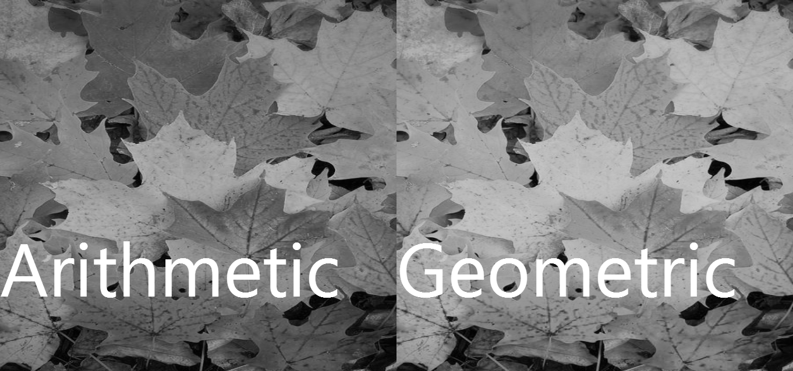
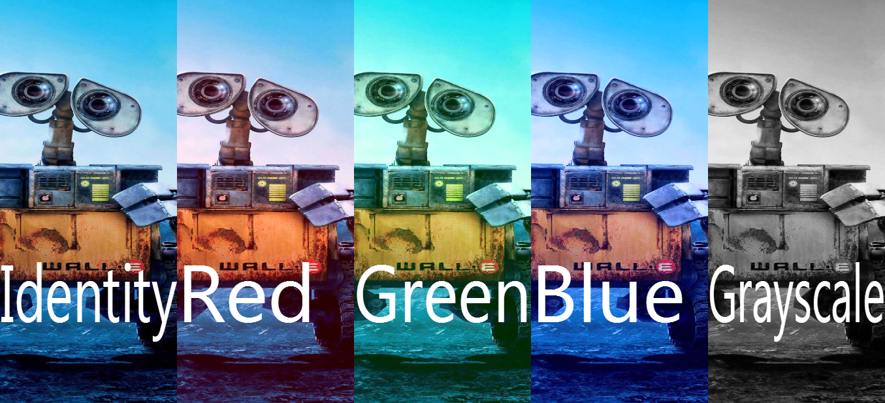
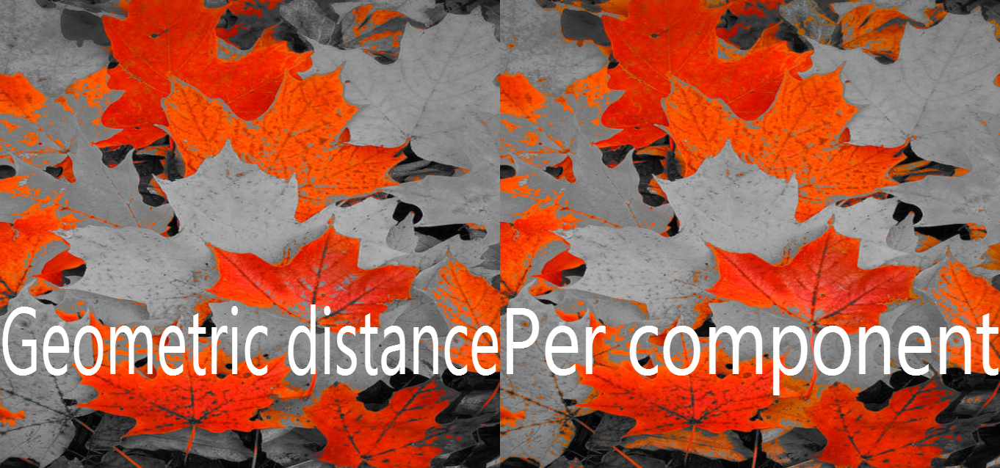
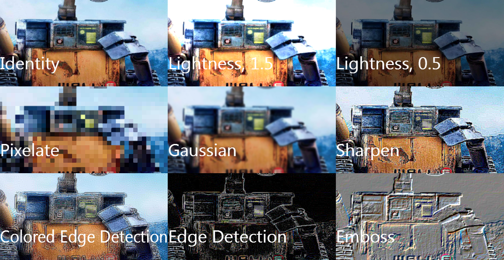

Here I am, minding my own business when suddenly a wild though appears – 'I wanna build my own image filtering app!' This turned to be more of a [JavaScript library](https://github.com/NikolaDimitroff/Filterme.js) than the full-blown app I imagined, but nevertheless I had a lot of fun building it so I'll share the experience.

As always,

#### Quick links to demos

* [Github repo to the library][filter-me]
* [Demo application][demo-link]

#### Preliminaries

Following the tradition, the code will be in JavaScript. I'll assume you have already discovered the magic of the canvas rendering in HTML. You might want to [read a refresher][canvas-refresher] if you've never worked in a graphics API. If you know how to work with DirectX / OpenGL, you'll be fine.

One small note before we begin - the method `getImageData` returns a single–dimensional, strongly–typed array of unsigned bytes. Every color's RGBA values are stored sequentially as one byte each, resulting in a total length of pixels * 4. We'll need that in a moment.

## This post

This post will go through both the math and the code for a couple filters, some more complex than others.

Before we start, let me explain how I have chosen to structure the code (respectively the library). Three main classes will carry most of the work. The `Color` class contains methods for manipulating colors stored in RGB with the option of converting them to and from HSL. The `Filter` class is an abstract base class which all our filtering effects will inherit from. Lastly, the `ImageDataHelper` class will provide several routines for getting colours from an image / image data.

There are various effects you can accomplish using several simple techniques and that's precisely what we are about to do. For simplicity, we'll always ignore the alpha channel in the calculations below.

All the techniques described below and more can be seen in action at this [demo][demo-link] created specifically for that.

## Simple algorithms

### Grayscaling

Grayscaled colors have their RGB components equal. The question that arises is, given a color, how do we grayscale it? We need to find some sort of a mean of all the channels. You may come up with many formulae for calculating means of 3 numbers, but the two simplest are arithmetic and geometric mean given by the formulae below:

$$
Arithmetic \; mean = \frac{R+G+B}{3} \\\\
Geometric \; mean = \sqrt{R^2+G^2+B^2}
$$

Now that we have the formula, we need to iterate over all pixels and use either of the above to compute the mean. Then, store the mean in all 3 components of the color and voila! Here's the code:

```js
Color.prototype.toGrayscale = function convertToGrayscale(grayscaleAlgorithm) {
    switch (grayscaleAlgorithm) {
        case Color.grayscaleAlgorithms.arithmeticMean:
            return (this.r + this.g + this.b) / 3;

        case Color.grayscaleAlgorithms.geometricMean:
            // We can't simply compute the geometric mean since its value may be
            // much more than 255. To fix that get the ratio of the geometric mean
            // and the maximum geometric mean (white has the maximum geometric mean).
            // Multiply that by 255 and convert to int
            return ~~((this.calculateLength() / Color.basicColors.white.calculateLength()) * 255);

        default:
            throw new RangeError("No such algorithm exists");
    }
};

GrayscaleFilter.prototype.transformImage = function (imageDataHelper) {
    var data = imageDataHelper.data;
    for (var i = 0; i < data.length; i += 4) {
        var color = imageDataHelper.colorAt(i);
        var grayscale = color.toGrayscale(this.grayscaleAlgo);
        data[i] = data[i + 1] = data[i + 2] = grayscale;
    }
};
```



### Adding a color to all pixels

One effect I particularly like is adding a constant color to all pixels in the scene. This filter produces awesome looking results when given an image that is mainly in one color and you add the color's inverse to it. In the example below, Wall–e's image is mostly bluish so we add a bit of red to get an effect I personally really dig.

Implementing this effect is as easy as it sounds. Just iterate over all pixels and add the predefined color to it (see [implementation here][add-color-impl]). The image below shows that effect when the constant color added is respectively red, green or blue as well as grayscaled.



### Colour inversion

To invert a colour means to take its complement in the RGB color space. That is, substract the maximum value for each channel for its current value to receive the result. Code and example follow.

```js
Color.prototype.invert = function invert() {
    return new Color(255 - this.r, 255 - this.g, 255 - this.b);
};
```

### Emphasizing a single color

One my favourite effects is emphasizing a single color by grayscaling all others (as in the [famous scene from Schindler's list][schindler-list-scene]). To do that, we need to grayscale only those pixels who differ from our target color more than a certain threshold. Of course, this presents another problem – how do we differ colors? Option 1 is to use the formula for vector distance, that is

<div>
$$
distance = \sqrt{(R_{1} – R_{2})^2+(G_{1} – G_{2})^2+(B_{1} – B_{2})^2}
$$
</div>

Option 2 is to check whether the difference per each component is greater than a given value. Both are shown in the following code. Note that when using a filter that drastically changes pixel colors, often artefacts are left on the image. To battle that, you can use antialiasing as I have done in the example image below. `ImageDataHelper` provides an antialias method fit precisely for that occasion.

```js
EmphasizeColorFilter.prototype.targetColorPredicate = function (color) {
    // In case we are using per component difference
    if (this.usePerComponentPredicate) {
        return Color.areTooDifferentPerComponent(this.targetColor, color, this.threshold);
    }
    // If the geometric distance between the color is larger than a threshold
    return this.targetColor.calculateDistanceTo(color) >= this.threshold;
};

EmphasizeColorFilter.prototype.transformImage = function (imageDataHelper) {
    var data = imageDataHelper.data;
    for (var i = 0; i < data.length; i += 4) {
        var color = imageDataHelper.colorAt(i);
        // If the predicate is true, that is the color is different enough than our target
        if (this.targetColorPredicate(color)) {
            var grayscale = color.toGrayscale(this.grayscaleAlgo);
            data[i] = data[i + 1] = data[i + 2] = grayscale;
        }
}
};
```



### Pixelation

It's not very common to reduce the quality of a image by pixelation but sometimes that's exactly what you need (hey, you might be working on Minecraft!). We can pixelate an image by dividing the image into many small –sized squares (such as 16x16). For each square we are to find the pixel in the middle and set the color of all pixels in the square to the color of the middle pixel:

```js
PixelateFilter.prototype.transformImage = function (imageDataHelper) {
    var data = imageDataHelper.data;
    var step = 4 * this.level;
    var levelOverTwo = ~~(this.level / 2);

    // Loop trough the image but skip all rows and columns whose indices are not divisible
    // by our pixelation level
    for (var x = 0; x < imageDataHelper.imageData.width; x += this.level) {
        for (var y = 0; y < imageDataHelper.imageData.height; y += this.level) {
            var index = imageDataHelper.xyToArrayCoordinate(x, y);
            var color = imageDataHelper.colorAt(index);
            // Get the indices of all colors in the square with size = this.level and
            // set their color to the color of pixel in the middle
            var neighbours = imageDataHelper.getExtendedVirtualNeighbours(index, this.level);
            for (var j = 0; j < neighbours.length; j++) {
                data[neighbours[j]] = color.r;
                data[neighbours[j] + 1] = color.g;
                data[neighbours[j] + 2] = color.b;
            }
        }
    }
};
```

## Convolution filters

I thoroughly enjoy confusing people with over usage of complex words. Today's word of the day, kids, is the word convolution as in image convolution. Image convolution refers to a particular technique of manipulating images. To transform the image you are given a square matrix of odd size. Call that matrix the convolution's kernel. Let it store random numbers which we'll call pixel weights. Your job is to simply center the matrix on the pixel you are currently transforming and multiply all of its neighbors by their respective weights and sum the results. The total gives you the final color that you need to give your pixel in question. Here's a gif I shamelessly stole from Wikipedia that describes the process well enough.


Implementing a convolution filter ain't much harder than the previous filters. For simplicity, I've added a separate `ConvolutionKernel` class that handles multiplying the kernel by the neighbours of a specific pixel. Take a look at the code below.

```js
ConvolutionKernel.prototype.multiplyImageAt = function (arrayCoordinate, imageDataHelper) {
    // Get the colors of all pixels in the neighbourhood
    var neighbours = imageDataHelper.getExtendedVirtualNeighbours(arrayCoordinate, this.size);
    var areaColors = imageDataHelper.getAreaColors(neighbours);
    var total = new Color(0, 0, 0);
    for (var i = 0; i < areaColors.length; i++) {
        var multiplied = areaColors[i].scalarMultiply(this.kernel[i]);
        total.r += multiplied.r;
        total.g += multiplied.g;
        total.b += multiplied.b;
    };
    // I'll explain the next 3 lines in a second
    total.r += this.bias;
    total.g += this.bias;
    total.b += this.bias;

    return total;
};
ConvolutionFilter.prototype.transformImage = function (imageDataHelper) {
    var size = imageDataHelper.data.length / 4;
    var imageData = imageDataHelper.data;
    // When using convolutions, each pixel's tranformed color depends on the pixels
    // around him so we can't transform the image in place.
    // Thus, create a temporary array to save the output to
    var renderTarget = [];
    for (var i = 0; i < size; i++) {
        var transformed = this.kernel.multiplyImageAt(i * 4, imageDataHelper);
        renderTarget.push(transformed);
    }

    var arrayCoordinate = 0;
    for (var i = 0; i < renderTarget.length; i++) {
        arrayCoordinate = i * 4;
        imageData[arrayCoordinate] = renderTarget[i].r;
        imageData[arrayCoordinate + 1] = renderTarget[i].g;
        imageData[arrayCoordinate + 2] = renderTarget[i].b;
    }
};
```

Here are some of effects you can achieve using convolution (pixelation is not one of them but I like how it stands next to Gaussian blurring).



I already told you that convolutions are an incredibly powerful tool. Let's prove that by exploring what we can do with them. Notice that we only need to change the convolution's kernel to produce a different result. Here's an incomplete sample list of some common kernels:

<div>
$$
\begin{aligned}

&\text{Sharpen} &= \begin{bmatrix} -1 & -1 & -1 \\\\ -1 & 9 & -1 \\\\ -1 & -1 & -1\end{bmatrix} \\\\
&\text{Blur} &= \begin{bmatrix} 0 & 0.2 & 0 \\\\ 0.2 & 0.2 & 0.2 \\\\ 0 & 0.2 & 0\end{bmatrix} \\\\
&\text{Horizontal Motion Blur} &= \begin{bmatrix} 0 & 0 & 0 \\\\ 0.2 & 0.2 & 0.2 \\\\ 0 & 0 & 0\end{bmatrix} \\\\
&\text{Edge detect} &= \begin{bmatrix} -1 & -1 & -1 \\\\ -1 & 8 & -1 \\\\ -1 & -1 & -1\end{bmatrix}

\end{aligned}
$$
</div>

There are some effects that need additional work after convoluting the image. One such is embossing (engraving) the image (which is particularly useful if you we need a [height map][height-map] or a [bump map][bump-map] which are commonly used in 3d graphics). To produce the final image we add a constant value (a bias) to all channels after the convolution. The emboss effect in the image below is produced with the kernel $\begin{bmatrix} -1 & -1 & 0 \\\\ -1 & 0 & 1 \\\\ 0 & 1 & 1\end{bmatrix}$ and $bias = 128$.

You probably are wondering why and how do these concrete kernels achieve the aforementioned effects. Well, that explanation goes outside the scope of this post but take a look [here][kernels-explained-1] and [there][kernels-explained-2] for further reading.

There are a few other simple effects included in [Filterme.js][filter-me] such as the multifilters – `BlendFilter` and `LayeredFilter`. The first blends the results of several other filters, while the second uses the output of the current filter as the input to the second. Go to [github][filter-me] to discover more of those.

[canvas-refresher]: https://developer.mozilla.org/en-US/docs/Web/API/Canvas_API/Tutorial
[add-color-impl]: https://github.com/NikolaDimitroff/Filterme.js/blob/master/FilterClasses/AdditiveFilter.js
[schindler-list-scene]: https://www.youtube.com/watch?v=j1VL-y9JHuI
[height-map]: https://en.wikipedia.org/wiki/Heightmap
[bump-map]: https://en.wikipedia.org/wiki/Bump_mapping
[kernels-explained-1]: https://alumni.media.mit.edu/~maov/classes/vision09/lect/09_Image_Filtering_Edge_Detection_09.pdf
[kernels-explained-2]: https://lodev.org/cgtutor/filtering.html
[filter-me]: https://github.com/NikolaDimitroff/Filterme.js
[demo-link]: http://demos.dimitroff.bg/filterme