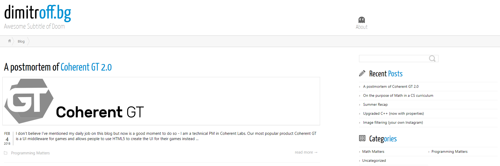

Up until yesterday this blog was powered by WordPress and looked like this:

This is why that's no longer the case.

I am big opponent of the 'not invented here' syndrome. There's a popular saying in Bulgaria ("Всяка жаба да си знае гьола") that can be roughly translated to 'Each frog should know its swamp' - effectively a metaphor for 'know your place'. I am all for that - I like building high-performance, real time systems and solving complex problems through math. Building a CMS is very much out of scope for me. Yet, I grew tired of some issues WordPress was giving me so I went ahead and ditched it for a static site of my own.

WordPress is an amazing CMS and the amount of things it powers is amazing on its own. It is, however, an overkill for some of my needs and yet insufficient for others.

## Why change

Here's an itemized list of things I find unnecessary in WordPress for my specific needs:

* I am not using 95%+ of the features WordPress has
* I want to author content using a combination of Markdown and LaTeX, not through a visual editor / HTML
    * Although there are plugins for that available, they occasionally act weird and misformat the output to look broken in some browsers / devices. I've spent way too much time trying to figure out what mix of HTML, the custom WP presentation language, LaTeX and MD are causing things to break.
* Storing articles under source control is nigh impossible because I either need to preserve the entire WP database or duplicate the posts
* Lack of source control leads to content duplication and lots of copy/pasting for common things
* WordPress themes are hard to customize
* Loading times are hard to control

Overall, it boils down to neither having enough knowledge to operate WordPress effectively, nor wanting to learn it, nor wanting to dabble in all of the complexity I'll never need to use.

## The new thing

This new version is custom made and all the code is available under the MIT license at [GitHub][github-link]. Feel free to replicate the setup for a blog of your own.

Before I began, I figured I need to list my requirements for the new website. They were very simple:

- a static site
- that displays blog pages written in Markdown, LaTeX and live demos
- shows as little information about me as needed to tell the reader who am I, yet keeps it visible everywhere to make it obvious

I decided to build the thing on top of [Vue.js][vue] and some custom article management. Every article is stored in a directory of its own which contains the Markdown file for it and any resources. Then, an offline script generates an index of all articles storing their name, creation time, edit time and any other meta data I'm interested in. The final website reads this index to visualize all articles and when someone clicks on a link, it loads the article and displays it.

The entire setup is minimal but since I need a Markdown parser, a LaTeX parser and a syntax highlighter, it still takes ~400 KB of resources to download.

I've had some concerns about replacing a well-known system with a homemade one but they all seem to have been in vain.

SEO was one of things I was worried about but the good guys at Vue and Google have already [taken care of the problem][vue-seo] SPAs present to search engines. Obviously, the SEO will still be inferior compared to all the cogs and wheels running in WP. Truth be told that's ok - it's not a goal of mine for this blog to be discoverable via search engines directly. I only need SEO to the point that if someone was to search for my name it, the blog would appear on first page.

Another thing I lost by dropping WordPress is comments. Since I am going completely client-side, there's no where to store the comments in the site itself. Thanks to some creative ideas from [Darek Kay][darek-kay-comments] I decided to use Twitter for comments. I'll be posting links to new articles on Twitter and any replies there will show as comments here (check the footer of this post for an example). Twitter threads also means that I don't have to worry about spam and that would also force people to talk to me directly on Twitter which is far more personal and engaging.

## Summary

I am very happy with the result - I created something that fits my needs perfectly and is incredibly simple to edit and manage. WordPress's value proposition to cater to people who don't know web tech and want to get something pretty with the least code possible is just not my cup of tea.

There are still some missing features which I would like to add later when I have extra time - like a tagging / search system. Fortunately, that's not critical at the moment since I don't have that many posts for the search to matter.

P.S. I tested the new version as much as possible but do let me know if you see any bugs.

[github-link]: https://github.com/nikoladimitroff/blog
[vue]: https://vuejs.org
[vue-seo]: https://medium.com/js-dojo/is-my-single-page-app-seo-friendly-be2c827f1c38
[darek-kay-comments]: https://darekkay.com/blog/static-site-comments/