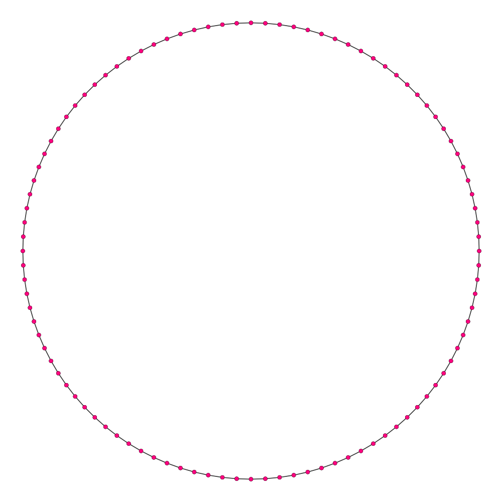

# Generating vertices of regular n-sided polygons/polyhedra and circles/spheres

There are a number of applications that make use of circles, spheres, regular polygons and polyhedra. Most of them are in the area of computer graphics and most likely you are reading this because you'd like to know how are those objects generated in 3D modeling tools or perhaps in that awesome drawing library you are using.

Other usage examples can be found in any software that needs to place some objects equidistantly around a circle - e.g. your favourite video game arena brawler which spawns ten enemies in a circle around the arena's center.

**Quick links to the demos shown in the article:**

1. [Polygons and circles][link-to-polygons]
2. [Polyhedra and spheres][link-to-polyhedra]
3. [Higher dimensions][link-to-higher-dim]

## Overview

Imagine an equilateral triangle. Do the same for a square. And again for a regular pentagon. Now imagine a regular hectogon (100-sided polygon). Doesn't it look more like a circle? If you can't imagine it, worry not. Here's how it looks like:



You just made an important observation – as n goes to infinity, n-sided polygons converge into a circle. This basically means that we if there's a an algorithm to generate a regular polygon for every n, then we can use a large enough number of sides to simulate / draw a circle. We can only draw something that looks like a circle but it's not *exactly* one, since a circle is a continuous set of points thus it has infinitely many points. The same rule applies to polyhedra and spheres (and as we'll see soon, applies to higher dimensions as well).

## The 2d case

The easiest way to generate the polygons we are after are is to change our coordinate system. The Cartesian coordinate system you are accustomed to using is best used for describing lines and polygons (planes and polyhedra in 3d). For circles / spheres a polar coordinate system is much better suited. Whereas the Cartesian system uses two perpendicular axes ($x$ and $y$), the polar system uses an angle ($\varphi$)and the distance from the center of the system ($r$). If you have never used such a system check out [this summary in Wikipedia](http://en.wikipedia.org/wiki/Polar_coordinate_system). Every paragraph starting from the next will assume you know your polar system and how to convert between Cartesian and polar coordinates.

Moreover, we will only use radians. Take a look [here](http://en.wikipedia.org/wiki/Radian#Conversion_between_radians_and_degrees) if you need a reminder in degrees to radians conversion.

The 2d circle has the following equation in a polar system (actually that is true for any other number of dimensions as well):

$$
r = a, \text{ where } a \text{ is the radius of the circle}
$$

Converting from polar system to Cartesian is done through the following equations

$$
\begin{equation}
x = r \cos \varphi \\\\
y = r \sin \varphi
\end{equation}
$$
Now make a quick observation. Since the vertices on the circle all have the same radius, therefore only their angle differs and to generate them we only need to change the angle ($\varphi$).

A second observation – a circle represents an angle with magnitude $2\pi$ radians. Therefore one can split it into n equal angles, with the $i$-th angle having magnitude $\frac {i2\pi} {n}. Generating those angles and the vertex coordinates in pseudocode goes like:

```js
for (i = 0; i < n; i++) {
    angle = i * 2 * Pi / n
    nextVertex.X = radius * cos(angle)
    nextVertex.Y = radius * sin(angle)
}
```

And that is it. You now have an algorithm for generating a regular n-sided polygon. Let `n = 100` and you have yourself a circle.

## Going 3d

In 3d the polar coordinate system becomes a spherical one. We now need 2 angles instead of one but everything else stays the same. The parametric equations of a sphere are:

<p>
$$
\begin{equation}
\begin{aligned}

&x=r\cos{\varphi} \\\\
&y=r\sin{\varphi}\cos{\theta} \\\\
&z=r\sin{\varphi}\sin{\theta}
\end{aligned}
\end{equation}
$$
</p>

Time for another observation. Take the ground (XZ) plane. Its intersection with the sphere will always be a circle (the intersection of any plane with a sphere is a circle). The points on that circle are defined by the radius of the sphere and just the first angle $\varphi$ because $\theta = 0$.

Now take the YZ plane. Its intersection once again is a circle. This time though, its points are defined by the sphere's radius and just the second angle $\theta$.

Therefore, to divide the sphere into equal volumes we need only split both circles into equal angles. But we already have an algorithm for doing that from the 2d case. It's easy see that the code breaks down to this:

```js
for (i = 0; i < n; i++) {
    for (j = 0; j < n; j++) {
        phi = i * 2 * Pi / n
        theta = j * 2 * Pi / n
        nextVertex.X = radius * cos(phi)
        nextVertex.Y = radius * sin(phi) * cos(theta)
        nextVertex.Z = radius * sin(phi) * sin(theta)
    }
}
```

This way we generate a n-sided polygon horizontally and vertically. Once again setting `n` to a big enough number causes the polyhedra to appear like a sphere.

What if you want the vertical polygons to have different size that the horizontal polygons thus creating new polyhedra or increasing the sphere approximation in just one direction? Easy, just introduce an additional parameter m. Now generate a n-sided polygon vertically and a m-sided one horizontally! Often n is called the number of width segments and m is known as the number of height segments. Finally, our polyhedra pseudo code looks like:

```js
for (i = 0; i < widthSegments; i++) {
    for (j = 0; j < heightSegments; j++) {
        phi = i * 2 * Pi / widthSegments
        theta = j * 2 * Pi / heightSegments
        nextVertex.X = radius * cos(phi)
        nextVertex.Y = radius * sin(phi) * cos(theta)
        nextVertex.Z = radius * sin(phi) * sin(theta)
    }
}
```

Set the number of width and height segments to a large enough number and enjoy a smooth sphere.

[This demo][link-to-polyhedra] uses the awesome [Three.js][three-js] to visualize the above algorithm. The library is open source and if you go check out the source code of its build-in sphere generator and strip out implementation details and the index buffer generation guess what's left:

```js
for (y = 0; y <= heightSegments; y++) {
    var verticesRow = [];
    for (x = 0; x <= widthSegments; x++) {
        var u = x / widthSegments;
        var v = y / heightSegments;

        var vertex = new THREE.Vector3();
        vertex.x = -radius * Math.cos(phiStart + u * phiLength) * Math.sin(thetaStart + v * thetaLength);
        vertex.y = radius * Math.cos(thetaStart + v * thetaLength);
        vertex.z = radius * Math.sin(phiStart + u * phiLength) * Math.sin(thetaStart + v * thetaLength);

        this.vertices.push(vertex);
        verticesRow.push(this.vertices.length - 1);
    }
    vertices.push(verticesRow);
}
```

## Generalization to higher dimensions

We can go beyond our 3d vision and talk about 4d spheres. Moreover, we can talk about n-dimensional spheres aka hyperspheres! Let's see how to generate those.
First off, some more observations.

1. We already saw that an n-dimensional polar system requires n – 1 angles and a radius.
1. Given what we know from the previous 2 algorithms (and of course given what Wikipedia says about hyperspheres) we can conclude that the parametric equations of a sphere are:

<p>
$$
\begin{equation}
\begin{aligned}

&x_1=r \cos{\varphi_1} \\\\
&x_2=r\sin{\varphi_1}\cos{\varphi_2} \\\\
&x_3=r \sin{\varphi_1}\sin{\varphi_2}\cos{\varphi_3} \\\\
&\dots \\\\
&x_{n-1}=r \sin{\varphi_1}\sin{\varphi_2}\dots\sin{\varphi_{n-2}}\cos{\varphi_{n-1}} \\\\
&x_n=r \sin{\varphi_1}\sin{\varphi_2}\dots\sin{\varphi_{n-2}}\sin{\varphi_{n-1}}

\end{aligned}
\end{equation}
$$
</p>

(when reading the Wikipedia article, take note that a n-sphere is defined as a ball in *(n+1)* dimensional space, while I define it as a ball in *n* dimensions to ease the reader)

The implementation is a bit trickier this time. We can't have a bunch of nested loops as we did in the previous cases since the number of loops varies depending on the dimensions. Instead, we'll generate all possible n-dimensional tuples. In every tuple, the i-th element will vary between 0 and the number of segments in that dimension. Given that we know the tuples, we can calculate the angles for each vertex as we did earlier – $\varphi_i =tuple[i] * 2 * \pi  / segments[i]$. Take a look at the tuple generation implementation in JS:

```js
var segments = [5, 4];
var radius = 1;

// A generic function to copy the tuple
function copy(array) {
    var newArray = [];
    for (var i = 0; i < array.length; i++) {
        newArray[i] = array[i];
    }
    return newArray;
}

// A function that computes the successor of a given tuple
function getNextTuple(lastGeneratedTuple) {
    var newTuple = copy(lastGeneratedTuple)
    for (i = segments.length - 1; i >= 0; i--) {
        // Increment the last coordinate. If it overflows, continue incrementing the next coordinate, else we are done
        newTuple[i]++;
        if (newTuple[i] > segments[i] - 1) {
            newTuple[i] = 0;
        }
        else {
            break;
        }
    }
    return newTuple;
}

// A function that enumerates all possible tuples
function enumerateAllTuples() {
    // The number of tuples is the product of all segments
    var numberOfTuples = 1;
    for (i = 0; i < segments.length; i++) {
        numberOfTuples *= segments[i];
    }
    var allTuples = [],
        zeroTuple = [];
    for (var i = 0; i < segments.length; i++) {
        zeroTuple[i] = 0;
    }
    allTuples[0] = zeroTuple;
    for (i = 1; i < numberOfTuples; i++) {
        allTuples[i] = getNextTuple(allTuples[i - 1]);
    }
    return allTuples;
}
```

Moving on to the actual vertices. The algorithm to produce them as follows:

1. Generate all tuples whose i-th coordinate is between 0 and `segments[i]`.
1. For each tuple, build the vertex.
    1. Calculate the actual angles from the values in the tuple.
    1. For each vertex coordinate:
        1. Set it to the radius.
        1. Multiply the coordinate by the sines of all angles with indices less than the index of the coordinate
        1. If it is that last coordinate, multiply it by sine of the last angle. Else, multiply it by the cosine of the angle with the same index as the coordinate.
    1. Some tuples produce the same vertex (for instance (0, 0, 1) and (0, 0, 2), use the formulae above to proof it). Check if the vertex has been generated and add it to the list only in case it isn't already there

The code awaits you below. You can test it [here][link-to-higher-dim]. Due to limited space on the page, only 12 dimensions are allowed.

```js
var epsilon = 0.000001;
// Function to test if the same vertex has already been produced
function isVertexGenerated(vertices, vertex) {
    var found = false;
    for (var i = 0; i < vertices.length; i++) {
        var current = vertices[i];
        for (var j = 0; j < vertex.length; j++) {
            if (Math.abs(current[j] - vertex[j]) > epsilon) {
                break;
            }
        }
        if (j == vertex.length) {
            found = true;
            break;
        }
    }
    return found;
}

function generatePoints() {
    var allTuples = enumerateAllTuples();
    var vertices = [];
    for (var k = 0; k < allTuples.length; k++) {
        var tuple = allTuples[k];

        // Compute the angles using the known formula
        var angles = [];
        for (j = 0; j < segments.length; j++) {
            angles[j] = tuple[j] * 2 * Math.PI / segments[j].value;
        }

        var nextVertex = [];
        var dimensions = segments.length + 1; // The total number of dimensions is the number of angles + 1
        // Go trough all coordinates of the vertex,
        // starting from one instead of 0 to be consistent with the math equations
        for (var i = 1; i < dimensions + 1; i++) {
            nextVertex[i] = radius;

            // Multiply by all sines with indices less than the index of the component
            for (var j = 1; j < i; j++) {
                nextVertex[i] *= Math.sin(angles[j - 1]);
            }
            // If it is not the last component,
            // multiply by the cosine of the angle with the same index
            if (i != dimensions) {
                nextVertex[i] *= Math.cos(angles[i - 1]);
            }
        }
        // Shift the array so we start from 0 instead of 1
        nextVertex.shift();
        // Check if we already haven't generated the same vertex
        var found = isVertexGenerated(nextVertex);
        if (!found) {
            vertices.push(nextVertex);
        }
    }
}
```

## Summary

The last algorithm is the most general and produces the same values as the 2d and 3d cases but obviously is much slower. Currently, hyperspheres and polytopes have limited application outside modern physics (most notable example is [string theory][string-theory]), but they certainly are an interesting topic. If you'd like to learn more about them Wikipedia has a [good set of articles][extra-articles].

Hope you've enjoyed the reading, don't hesitate to ask questions and make suggestions for improvements.

[link-to-polygons]: http://demos.dimitroff.bg/polygons
[link-to-polyhedra]: http://demos.dimitroff.bg/polyhedra
[link-to-higher-dim]: http://demos.dimitroff.bg/hyperspheres
[three-js]: http://threejs.org/
[three-js-sphere]: https://github.com/mrdoob/three.js/blob/master/src/extras/geometries/SphereGeometry.js
[string-theory]: http://en.wikipedia.org/wiki/String_theory
[extra-articles]: http://en.wikipedia.org/wiki/Category:Polytopes
