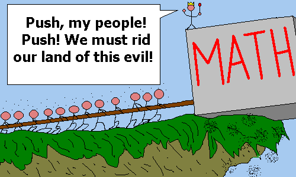

Here I am again, presenting to you another article with a bunch of scary math.



#### TL;DR

I made a [simple JavaScript library][cfg-solver] that allows you to validate complex user input whenever regular expressions can't help you (validating formulae for example). Unfortunately, due to the algorithm's generality it ain't the quickest. Go to last section to see how to use the library if you are interested.

#### Quick link to demo

[Validating words in sample grammars][demo-link]

## WTF is a context-free grammar?

Theoretical computer scientists spent an awful lot of time examining properties of certain languages (actually that's how they created programming languages). They've discovered that there are a few classes of languages that are useful in practice. These classes can be arranged into a hierarchy called [Chomsky's hierarchy][chomsky-hierarchy] named after the famous linguist Noam Chomsky. Two of the most important of those classes are the regular languages (languages that you can use regular expressions to match) and the context-free languages about which this article is all about. Now what exactly is a language? Let's take a look at a few definitions.

* We'll call an **alphabet**, any set of characters we'll call and we'll denote it with $\Sigma$.
* We'll call a **word (string)**, any sequence of characters over a given alphabet and denote by $w$.
* The word with length 0 will be called the **empty word** and be denoted with $\epsilon$
* We'll call a **language** any set (be it finite or infinite) of words (strings) over a given alphabet. Denote it with $L$.

Languages are just a formal way to say 'Here's a collection of strings that have the same structure / look alike / fall under the same rules'. Say we are given a language. How do you think we can:

* Generate a random string in the language?
* Tell whether a specific string is in the language?

Well, there is no general algorithm that can solve the tasks above for any language ([no such algorithm can even exist!][halting-problem]) but for certain classes of languages there are. Having said that, we arrive at our final definition which I know looks quite confusing, so read it twice if you need to.

Firstly, call a **nonterminal** any special character that will allow us to do control the structure of generated words in the language (think of it as a variable). We'll denote nonterminals with uppercase letters.
Secondly, consider an object which consists of the following:

1. A set of nonterminals $N$
1. An alphabet $\Sigma$ – call the alphabet's characters **terminals**
1. A special nonterminal $S \in N$ which we call the start symbol
1. A set of derivation rules $R$ that allow us to substitute a nonterminal for a mixed sequence of nonterminals and terminals

Formally, our object is the quadruple $G=<N, \Sigma, S, R >$. We just gave birth to a context–free grammar (CFG).

## That's a lot of definitions, now what?

It'll will make more sense to give you an example. Let's say we have this grammar:

<div>
$$
\begin{equation}
\begin{aligned}

&G = < \{ S \}, \{ a, b \}, S, R>, \text{ where }\\\\
&R = \{ S \rightarrow aSb, S \rightarrow ab \}

\end{aligned}
\end{equation}
$$
</div>

This means that we have a single nonterminal – the starting symbol $S$ and the alphabet consists solely from the letters $a$ and $b$. Let's put our grammar to practice.

We'll start with… well – the starting symbol. Apply on the start symbol any of our two rules by substituting $S$ with the right hand side of the rule until there's nothing to be replaced. Rules are chosen arbitrarily. One example run of the the algorithm might go like that

$$
S \Rightarrow aSb \Rightarrow aaSbb \Rightarrow aaabbb
$$

Another example would be:

$$
S \Rightarrow ab
$$

The algorithms picks any of the rules in $R$ at random and replaces the left-hand side with the right-hand side. It stops when there are no nonterminals that can be replaced. The nature of the CFG guarantees that all generated words have the same structure. In this case, we came up with a CFG that generated the language consisting of all words which start with some number of *a* and end with the same number of *b* letters. So basically $L = \\{ ab, aabb, aaabbb, \dots \\}$

Consider another grammar:

$$
S=<\{ S, A, N, V, \}, \text{all lowercase English letters and whitespace}, S, R >
$$

where the rules $R$ are:
* $S \rightarrow N \; V \; A$
* $A \rightarrow awesome \; | \; handsome \; | \; legendary$
* $N \rightarrow dimitroff \; | \; nikola \; | \; the \; author$
* $V \rightarrow is$

(the disjunction symbol $|$ allows us to conveniently write several rules on one line -  $N \rightarrow dimitroff \; | \; nikola \; | \; the \; author$ is equivalent to $ N \rightarrow dimitroff, N \rightarrow nikola, N \rightarrow the \; author$

Applying rules at random we can generate
$$
S \Rightarrow N \; V \; A \Rightarrow nikola \; V \; A \Rightarrow nikola \; is \; A \Rightarrow nikola \; is \; awesome
$$

Clearly, the grammar just presented can construct valid English sentences. Even more, you can construct incredibly complex grammars that generate an astonishing amount of words. Let us call any language that can be produced by CFG a context–free language.

## Recognizing context–free languages

A great deal of languages are context–free. For example, almost all programming languages you've learnt or heard of are CF. Furthermore, the compilers and interpreters for those languages make heavy use of CFGs. [Here's the grammar used to produce the JavaScript language.][js-cfg]

All languages created by regular expressions are context–free. Unfortunately, most context–free languages can't be described with regular expressions and this is why we must use grammars. There are a few algorithms that deal with the question ‘Does this string belong to this CF language?'. Compilers usually use [LR parsers][lr-parsers] but the latter only work on a special subset of CFGs. The library I wish to present to you uses the more general (and thus slower) [CYK algorithm][cyk-algorithm] for solving the same problem. When saying slower, I mean really slow – worst time is $O(|G|n^3)$ - that is cubic in the length of the word being validated and linear in the size of grammar (the grammar's size is the length of all rules combined).

The algorithm works in two steps:

* Pre-process the grammar – normalize it, precompute some important sets
* Given a word, use CYK to test whether the word is valid

I won't go into details but you can read more in [this paper by Lange and Leiss][cyk-paper].

Here's a really [simple demo][demo-link] to see that CYK actually works that runs it against a couple of simple grammars. Now, if you have some complex input that you want validated (like balanced parenthesis), this library can take care of it. The next section discusses how.

## Using the [CfgSolver library][cfg-solver]

The [CfgSolver][cfg-solver] you simply follow the steps I outlined above. Begin by creating your grammar as a standard JS object. Here's an example grammar and its JS representation:

$$
G=<\{ E, N \}, \{ +, -, *, /, 0, 1, 2, 3, 4, 5, 6, 7, 8, 9 \}, E, R>
$$
with rules $R$

* $E \rightarrow EOE | N$
* $O \rightarrow + | - | * | / $
* $N \rightarrow NN | 0 | 1 | 2 | 3 | 4 | 5 | 6 | 7| 8 | 9$$

The rules effectively say that

* an expression is either an operation over two other expressions or simply a number
* an operation is either +, -, *, /
* a number is either two numbers concatenated or a single digit

This grammar generates all arithmetic expressions without parentheses (the only problem here is that there may be leading 0s but for simplicity we won't deal with it). Here's the JavaScript object that represents the grammar:

```js
const grammar = {
        "E": ["EOE", "N"],
        "O": ["+", "-", "*", "/"],
        "N": ["NN", "0", "1", "2", "3", "4", "5", "6", "7", "8", "9",],
}
```

Pretty much the same thing, eh? Assuming you already included the solver script in your own script, used the grammar like that:

```js
// Pre-process the grammar and save the returned container in a variable
const container = CfgSolver.preprocess(grammar);
// Use the container to test whether a word is valid
const word = "5+3*4";
const isValid = CfgSolver.recognizeWord(container, word); // isValid is now true
```

## Notes

There are a few things I couldn't find where to fit, so I'll just drop them all here.

1. When designing your grammar, be careful what symbols you are using. Nonterminals must always be single characters and once a nonterminal has been declared you may not use the same symbol as terminal e.g. if you want to derive a word containing capital S you must not use S as nonterminal.
1. Sometimes, it is convenient to have a rule that derives nothing (remember we denote the empty string with ε). For instance, you might want to model variable declaration in C# with the following grammar:
    * $S\rightarrow TA N;$
    * $T \rightarrow int | long | char | \ldots$
    * $A \rightarrow [\;] | \epsilon$
    * $ N \rightarrow aN | bN | cN | a | b| c$

    ($T$ stands for type, $A$ stands for array square brackets and is optional, $N$ stands for name – for simplicity names can only be strings containing the letters a, b and c)

    This grammar allows to have both array and normal variables declared. In case an array is declared use the rule $A \rightarrow [\;]$, else use the rule $A \rightarrow \epsilon$. To write a rule deriving the empty word in your JavaScript, use `CfgSolver.epsilon`
1. Unfortunately, the CYK version used in the library doesn't allow the empty string to be derived from the start symbol (for improved performance). An empty string is not a very interesting string so that's not a loss to mourn about but you need to be careful when designing your grammar. Here's an example grammar that indirectly derives the start symbol:
    * $S \rightarrow AB | \ldots$
    * $A \rightarrow \epsilon | \ldots$
    * $B \rightarrow \epsilon | \ldots $

    Applying the rules $S \rightarrow AB \rightarrow \epsilon B \rightarrow \epsilon \epsilon \rightarrow \epsilon$$ derives the empty word and CfgSolver will throw an exception when pre-processing your grammar.
1. CfgSolver provides a printer property that prints your grammar in the console in a readable way:

    ```js
    CfgSolver.printer.printGrammar(grammar);
    ```

[demo-link]: http://demos.dimitroff.bg/cfgsolver
[chomsky-hierarchy]: https://en.wikipedia.org/wiki/Chomsky_hierarchy
[halting-problem]: https://en.wikipedia.org/wiki/Halting_problem
[js-cfg]: https://www-archive.mozilla.org/js/language/grammar14.html
[lr-parsers]: https://en.wikipedia.org/wiki/LR_parser
[cyk-algorithm]: https://en.wikipedia.org/wiki/CYK_algorithm
[cyk-paper]: https://www.informatica-didactica.de/cmsmadesimple/index.php?page=LangeLeiss2009
[cfg-solver]: https://github.com/NikolaDimitroff/CfgSolver
